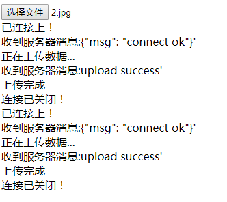
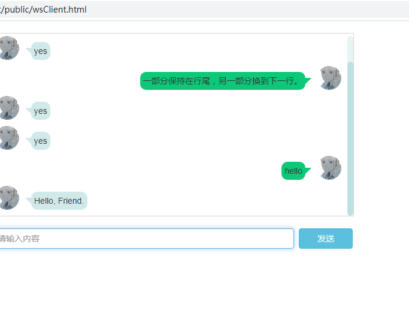

# Swoole简单入门示例
Swoole可以让PHP 开发人员可以编写高性能的异步并发 TCP、UDP、Unix Socket、HTTP，WebSocket 服务。Swoole 可以广泛应用于互联网、移动通信、企业软件、云计算、网络游戏、物联网（IOT）、车联网、智能家居等领域。
# 前提
使用Composer构建项目，构建好项目。
参考:http://www.shanhubei.com/composer-swoole.html
或者利用搜索引擎。
本篇介绍以下几个示例：
一、<a href="#demo1">使用Swoole发送邮件</a>
二、<a href="#demo2">使用Swoole实现在线聊天</a>
三、<a href="#demo3">使用Systemctl管理Swoole服务</a>
四、<a href="#demo4">使用Swoole实现毫秒级定时任务</a>
五、<a href="#demo5">使用Websocket上传文件</a>

# 部分预览




# <a id="demo1"> 一、使用Swoole发送邮件 </a>
使用composer安装邮件发送组件：phpmailer。
```
composer require phpmailer/phpmailer
```
## 主程序
在目录：src/app/下建立Mail.php，用作Swoole服务端主程序。
```
<?php 
namespace Shanhubei\Swoole;

use swoole_server;
use Redis;
use PHPMailer\PHPMailer\PHPMailer;
use PHPMailer\PHPMailer\Exception;

class Mail
{
    protected $serv;
    protected $host = '127.0.0.1';
    protected $port = 9502;
    // 进程名称
    protected $taskName = 'swooleMailer';
    // PID路径
    protected $pidPath = '/run/swooleMail.pid';
    // 设置运行时参数
    protected $options = [
        'worker_num' => 4, //worker进程数,一般设置为CPU数的1-4倍  
        'daemonize' => true, //启用守护进程
        'log_file' => '/data/logs/swoole.log', //指定swoole错误日志文件
        'log_level' => 0, //日志级别 范围是0-5，0-DEBUG，1-TRACE，2-INFO，3-NOTICE，4-WARNING，5-ERROR
        'dispatch_mode' => 1, //数据包分发策略,1-轮询模式
        'task_worker_num' => 4, //task进程的数量
        'task_ipc_mode' => 3, //使用消息队列通信，并设置为争抢模式
        //'heartbeat_idle_time' => 600, //一个连接如果600秒内未向服务器发送任何数据，此连接将被强制关闭
        //'heartbeat_check_interval' => 60, //启用心跳检测，每隔60s轮循一次
    ];
    // 邮件服务器配置
    protected $mailConfig = [
        'smtp_server' => 'smtp.163.com',
        'username' => 'username@163.com',
        'password' => '密码/口令',// SMTP 密码/口令
        'secure' => 'ssl', //Enable TLS encryption, `ssl` also accepted
        'port' => 465, // tcp邮件服务器端口
    ];
    // 安全密钥
    protected $safeKey = 'MDDGnQE33ytd2jDFADS39DSEWsdD24sK';


    public function __construct($mailConfig, $options = [])
    {
        // 构建Server对象，监听端口
        $this->serv = new swoole_server($this->host, $this->port);

        if (!empty($options)) {
            $this->options = array_merge($this->options, $options);
        }
        $this->serv->set($this->options);

        $this->mailConfig = $mailConfig;

        // 注册事件
        $this->serv->on('Start', [$this, 'onStart']);
        $this->serv->on('Connect', [$this, 'onConnect']);
        $this->serv->on('Receive', [$this, 'onReceive']);
        $this->serv->on('Task', [$this, 'onTask']);  
        $this->serv->on('Finish', [$this, 'onFinish']);
        $this->serv->on('Close', [$this, 'onClose']);

        // 启动服务
        //$this->serv->start();
    }

    protected function init()
    {
        //
    }

    public function start()
    {
        // Run worker
        $this->serv->start();
    }

    public function onStart($serv)
    {
        // 设置进程名
        cli_set_process_title($this->taskName);
        //记录进程id,脚本实现自动重启
        $pid = "{$serv->master_pid}\n{$serv->manager_pid}";
        file_put_contents($this->pidPath, $pid);
    }

    //监听连接进入事件
    public function onConnect($serv, $fd, $from_id)
    {
        $serv->send($fd, "Hello {$fd}!" );
    }

    // 监听数据接收事件
    public function onReceive(swoole_server $serv, $fd, $from_id, $data)
    {
        $res['result'] = 'failed';
        $key = $this->safeKey;

        $req = json_decode($data, true);
        $action = $req['action'];
        $token = $req['token'];
        $timestamp = $req['timestamp'];

        if (time() - $timestamp > 180) {
            $res['code'] = '已超时';
            $serv->send($fd, json_encode($res));
            exit;
        }

        $token_get = md5($action.$timestamp.$key);
        if ($token != $token_get) {
            $res['msg'] = '非法提交';
            $serv->send($fd, json_encode($res));
            exit;
        }

        $res['result'] = 'success';
        $serv->send($fd, json_encode($res)); // 同步返回消息给客户端
        $serv->task($data);  // 执行异步任务

    }

    /**
    * @param $serv swoole_server swoole_server对象
    * @param $task_id int 任务id
    * @param $from_id int 投递任务的worker_id
    * @param $data string 投递的数据
    */
    public function onTask(swoole_server $serv, $task_id, $from_id, $data)
    {
        $res['result'] = 'failed';
        $req = json_decode($data, true);
        $action = $req['action'];
        echo date('Y-m-d H:i:s')." onTask: [".$action."].\n";
        switch ($action) {
            case 'sendMail': //发送单个邮件
                $mailData = [
                    'emailAddress' => '337899329@qq.com',
                    'subject' => 'swoole demo',
                    'body' => '测试This is the HTML message body <b>in bold!</b>,<br/>欢迎访问<a href="http://www.shanhubei.com/">www.shanhubei.com</a>'
                ];
                $this->sendMail($mailData);
                break;
            case 'sendMailQueue': // 批量队列发送邮件
                $this->sendMailQueue();
                break;
            default:
                break;
        }
    }


    /**
    * @param $serv swoole_server swoole_server对象
    * @param $task_id int 任务id
    * @param $data string 任务返回的数据
    */
    public function onFinish(swoole_server $serv, $task_id, $data)
    {
        //
    }


    // 监听连接关闭事件
    public function onClose($serv, $fd, $from_id) {
        echo "Client {$fd} close connection\n";
    }

    public function stop()
    {
        $this->serv->stop();
    }

    private function sendMail($mail_data = [])
    {
        $mail = new PHPMailer(true);
        try {
            $mailConfig = $this->mailConfig;
            //$mail->SMTPDebug = 2;        // 启用Debug
            $mail->isSMTP();   // Set mailer to use SMTP
            $mail->Host = $mailConfig['smtp_server'];  // SMTP服务
            $mail->SMTPAuth = true;                  // Enable SMTP authentication
            $mail->Username = $mailConfig['username'];    // SMTP 用户名
            $mail->Password = $mailConfig['password'];     // SMTP 密码/口令
            $mail->SMTPSecure = $mailConfig['secure'];     // Enable TLS encryption, `ssl` also accepted
            $mail->Port = $mailConfig['port'];    // TCP 端口

            $mail->CharSet  = "UTF-8"; //字符集
            $mail->Encoding = "base64"; //编码方式

            //Recipients
            $mail->setFrom($mailConfig['username'], 'Shanhubei'); //发件人地址，名称
            $mail->addAddress($mail_data['emailAddress'], '亲');     // 收件人地址和名称
            //$mail->addCC('hellowebanet@163.com'); // 抄送

            //Attachments
            if (isset($mail_data['attach'])) {
                $mail->addAttachment($mail_data['attach']);         // 添加附件
            }
            
            //$mail->addAttachment('/tmp/image.jpg', 'new.jpg');    // Optional name

            //Content
            $mail->isHTML(true);                                  // Set email format to HTML
            $mail->Subject = $mail_data['subject'];
            $mail->Body    = $mail_data['body'];
            //$mail->AltBody = '这是在不支持HTML邮件客户端的纯文本格式';

            $mail->send();
            return true;
        } catch (\Exception $e) {
            echo 'Message could not be sent. Mailer Error: '. $mail->ErrorInfo;
            return false;
        }
    }
	
	// 邮件发送队列
    private function sendMailQueue()
    {
        $redis = new Redis();
        $redis->connect('127.0.0.1', 6379);
       
        //$password = '123';
        //$redis->auth($password);

        swoole_timer_tick(1000, function($timer) use ($redis) { // 启用定时器，每1秒执行一次
            $value = $redis->lpop('mailerlist');
            if($value){
                //echo '获取redis数据:' . $value;
                $json = json_decode($value, true);
                $start = microtime(true);
                $rs = $this->sendMail($json);
                $end = microtime(true);
                if ($rs) {
                    echo '发送成功！'.$value.', 耗时:'. round($end - $start, 3).'秒'.PHP_EOL;
                } else { // 把发送失败的加入到失败队列中，人工处理
                    $redis->rpush("mailerlist_err", $value);
                }
            }else{
                swoole_timer_clear($timer); // 停止定时器
                echo "Emaillist出队完成";
            }
        });
    }

    
}

```
## 运行服务端
在public/目录下建立mailServer.php，代码如下：
```
<?php 
require dirname(__DIR__) . '/vendor/autoload.php';

use Shanhubei\Swoole\Mail;

$config = [
    'smtp_server' => 'smtp.163.com',
    'username' => 'xxxxx@163.com',
    'password' => 'xxxx',// SMTP 密码/口令
    'secure' => 'ssl', //Enable TLS encryption, `ssl` also accepted
    'port' => 465, // tcp邮件服务器端口
];
$server = new Mail($config);
$server->start();

```
你可以注册一个163邮箱，然后开通smtp功能。我DEMO中使用的是163邮箱发邮件发多了被封号了，所以在线演示demo没上传了。配置好邮件服务器参数后，运行：
```
php mailServer.php
```
此时再使用命令`netstat -lntp`查看进程。
## 运行客户端

在public/目录下新建mailClient.php，代码如下：
```
<?php 
class Client
{
    private $client;
    
    public function __construct() {
        $this->client = new swoole_client(SWOOLE_SOCK_TCP);
    }

    public function connect($type) {
        if( !$this->client->connect("127.0.0.1", 9502 , 1) ) {
            echo "Error: {$this->client->errMsg}[{$this->client->errCode}]\n";
        }
        // fwrite(STDOUT, "请输入消息 Please input msg：");
        // $msg = trim(fgets(STDIN));
        $action = 'sendMail';
		if($type == 'q'){
			$action = 'sendMailQueue';
		}
        $time = time();
        $key = 'MDDGnQE33ytd2jDFADS39DSEWsdD24sK';
        $token = md5($action.$time.$key);
        $data = [
            'action' => $action,
            'token' => $token,
            'timestamp' => $time
        ];
        $msg = json_encode($data);

        $this->client->send( $msg );
        $message = $this->client->recv();
        echo "Get Message From Server:{$message}\n";
    }
}

$type = 'q';  //区分批量和单个发送标志

if($type == 'q'){
	$redis = new \Redis();
	$redis->connect('127.0.0.1', 6379);

	//$password = '123456x';
	///$redis->auth($password);

	$arr = [];

	$arr[0] = [
		'subject' => '注册cloudfog-HA',
		'emailAddress' => '337899329@qq.com',
		'body' => '您好，您的CloudFog使用的用户名是：123, 密码是：123。<br/>请不要将此邮件泄漏给他人，并尽快登录CloudFog更换新密码。如有疑问请联系管理员。'
	];
	$arr[1] = [
		'subject' => '注册cloudfog2',
		'emailAddress' => '2823175272@qq.com',
		'body' => '<a href="https://www.shanhubei.com" target="_blank">网易邮箱</a>'
	];
		  
	foreach ($arr as $k=>$v) {
		$redis->rpush("mailerlist", json_encode($v, JSON_UNESCAPED_UNICODE));
	}	
}

$client = new Client();
$client->connect($type);
```
### 运行命令启动客户端：
```
php mailClient.php
```
此时在命令行窗口会返回如下信息：
```
[root@localhost public]# php mailClient.php 
Get Message From Server:{"result":"success"}
```
这样就已经执行邮件发送任务了，如果出现故障，可以查看日志文件`/data/logs/swoole.log`。

然后你可以去查看对方邮箱是否收到相关邮件。
本文中使用了redis作为简单队列，你也可以使用复杂点的队列rabbitmq。你也可以使用Crontab来做定时任务，不过它最小粒度是分钟级别的。当然对于批量发送邮件，如果你不用php的话，可以用Python或者Java，它们都有相当成熟的解决方案。

# <a id="demo2">二、使用Swoole实现在线聊天</a>
### 建立服务端主程序
准备工作就绪后，我们开始来撸代码。

首先在项目目录：src/app/ 下建立`Chat.php`，用作Swoole服务端主程序。

Chat.php文件的主体结构是这样的：
```
<?php 
namespace Shanhubei\Swoole;
use swoole_websocket_server;
class Chat
{
    protected $ws;
    protected $host = '0.0.0.0';
    protected $port = 9504;
    // 进程名称
    protected $taskName = 'swooleChat';
    // PID路径
    protected $pidFile = '/run/swooleChat.pid';
    // 设置运行时参数
    protected $options = [
        'worker_num' => 4, //worker进程数,一般设置为CPU数的1-4倍  
        'daemonize' => true, //启用守护进程
        'log_file' => '/data/logs/chatswoole.log', //指定swoole错误日志文件
        'log_level' => 3, //日志级别 范围是0-5，0-DEBUG，1-TRACE，2-INFO，3-NOTICE，4-WARNING，5-ERROR
        'dispatch_mode' => 1, //数据包分发策略,1-轮询模式
    ];
 

    public function __construct($options = [])
    {
        $this->ws = new swoole_websocket_server($this->host, $this->port);

        if (!empty($options)) {
            $this->options = array_merge($this->options, $options);
        }
        $this->ws->set($this->options);

        $this->ws->on("open", [$this, 'onOpen']);
        $this->ws->on("message", [$this, 'onMessage']);
        $this->ws->on("close", [$this, 'onClose']);
    }

    public function start()
    {
        // Run worker
        $this->ws->start();
    }

    public function onOpen(swoole_websocket_server $ws, $request)
    {
        // 设置进程名
        cli_set_process_title($this->taskName);
        //记录进程id,脚本实现自动重启
        $pid = "{$ws->master_pid}\n{$ws->manager_pid}";
        file_put_contents($this->pidFile, $pid);

        echo "server: handshake success with fd{$request->fd}\n";
    }

    public function onMessage(swoole_websocket_server $ws, $frame)
    {
        //$ws->push($frame->fd, "server-push:".date("Y-m-d H:i:s"));
        $connets = $ws->connections;
        echo count($connets)."\n";
        echo $frame->data. "\n";
        if ($frame->data == '美女') {
            $mmpic = [
                'http://pic15.photophoto.cn/20100402/0036036889148227_b.jpg',
                'http://pic23.nipic.com/20120814/5914324_155903179106_2.jpg',
                'http://pic40.nipic.com/20140403/8614226_162017444195_2.jpg'
            ];
            $picKey = array_rand($mmpic);
            $ws->push($frame->fd, file_get_contents($mmpic[$picKey]), WEBSOCKET_OPCODE_BINARY);
        } else {
            $ws->push($frame->fd, $this->reply($frame->data));
        }
        
    }

    public function onClose($ws, $fid)
    {
        echo "client {$fid} closed\n";
        foreach ($ws->connections as $fd) {
            $ws->push($fd, $fid. '已离开！');
        }
    }

    private function reply($str) {
        $str = mb_strtolower($str);
        switch ($str) {
            case 'hello':
                $res = 'Hello, Friend.';
                break;

            case 'fuck':
                $res = 'Fuck bitch.';
          
                break;
            case 'ping':
                $res = 'PONG.';
                break;
            case 'time':
                $res = date('H:i:s');
                break;
            
            default:
                $res = $str;
                break;
        }
        return $res;
    }
}
```
我们需要往`onMessage()`方法里填代码。在这里，服务端接收客户端消息，并作出相应动作。Websocket可以向客户端发送字符串、二进制等形式消息。
```
public function onMessage(swoole_websocket_server $ws, $frame)
    {
        //$ws->push($frame->fd, "server-push:".date("Y-m-d H:i:s"));
     if ($frame->data == '美女') {
            $mmpic = [
                'http://pic15.photophoto.cn/20100402/0036036889148227_b.jpg',
                'http://pic23.nipic.com/20120814/5914324_155903179106_2.jpg',
                'http://pic40.nipic.com/20140403/8614226_162017444195_2.jpg'
            ];
            $picKey = array_rand($mmpic); //随机返回一张图片
            $ws->push($frame->fd, file_get_contents($mmpic[$picKey]), WEBSOCKET_OPCODE_BINARY);
        } else {
            $ws->push($frame->fd, $this->reply($frame->data));
        }
    }

    private function reply($str) {
        $str = mb_strtolower($str);
        switch ($str) {
            case 'hello':
                $res = 'Hello, Friend.';
                break;

            case 'fuck':
                $res = 'Fuck bitch.';
                break;
            case 'ping':
                $res = 'PONG.';
                break;
            case 'time':
                $res = date('H:i:s');
                break;
            
            default:
                $res = $str;
                break;
        }
        return $res;
    }
```
将上面代码加入到Chat.php中，用来处理接收消息并响应回复。响应回复的内容可以根据实际情况修改，本代码只是用来演示。

启动服务端
在public/目录下建立chatServer.php，代码如下：
```
<?php 

require dirname(__DIR__) . '/vendor/autoload.php';

use Shanhubei\Swoole\Chat;

$opt = [
    'daemonize' => true
];
$ws = new Chat($opt);
$ws->start();
```
然后运行以下代码启动服务端：
`php chatServer.php`
如果一切正常，你可以netstat -lntp看一下，系统会监听进程名为swooleChat，端口为9504的服务。

### 启动客户端
我们使用HTML5的websocket客户端来连接服务端，本地建立wsClient.html
```
<!DOCTYPE html>
<html>
<head>
    <meta charset="utf-8">
    <meta http-equiv="X-UA-Compatible" content="IE=edge">
    <meta name=viewport content="width=device-width,initial-scale=1,maximum-scale=1,user-scalable=no">
    <title>Client</title>
    <link rel="stylesheet" href="https://cdn.bootcss.com/bootstrap/3.3.5/css/bootstrap.min.css">
    <link rel="stylesheet" href="css/chat.css">
</head>
<body>
    <div id="chat-wrap">
        <div id="result"></div>
        <ul class="chat-thread">
            <li class="you"><p>Are we meeting today?</p></li>
            <li class="you"><p>yes</p></li>
            <li class="me"><p>一部分保持在行尾，另一部分换到下一行。</p></li>
            <li class="you"><p>yes</p></li>
            <li class="you"><p>yes</p></li>
        </ul>
        
    </div>
    <div class="send">
        <form action="">
          <input type="text" class="form-control" id="m" autocomplete="off" placeholder="请输入内容">
          <button type="submit" class="btn btn-info">发送</button>
        </form>
    </div>
<!-- <div>
    <div id="result"></div>
    <form class="form-inline" action="">
      <div class="form-group">
        <input type="text" class="form-control" id="m" autocomplete="off" placeholder="请输入内容">
      </div>
      <button type="submit" class="btn btn-info">发送</button>
    </form>
</div> -->
<script src="https://cdn.bootcss.com/jquery/2.2.4/jquery.min.js"></script>
<script>
if ("WebSocket" in window) {
    var ws = new WebSocket("ws://192.168.3.105:9504");

    var result = document.querySelector('#result');

    var chatthread = document.querySelector('.chat-thread');
    chatthread.scrollTop = chatthread.scrollHeight;

    ws.onopen = function() {
        result.innerHTML = '已连接上！';
        $('#result').show().html('已连接上！').fadeOut(1500);
        console.log('已连接上！');
    }

    document.querySelector('form').onsubmit = function(e) {
        var msg = document.querySelector('#m').value;
        ws.send(msg);
        $('.chat-thread').append('<li class="me"><p>'+msg+'</p></li>');
        chatthread.scrollTop = chatthread.scrollHeight;
        document.querySelector('#m').value = '';
        return false;
    }
    ws.onmessage = function(e) {
        if(e.data instanceof Blob) {
            // var img = document.createElement("img");
            // img.src = window.URL.createObjectURL(e.data);
            // result.appendChild(img);
            // var d = window.URL.createObjectURL(e.data);
            // console.log(d);
            var img = '';
            $('.chat-thread').append('<li class="you"><p>'+img+'</p></li>');
        }else {
            // var p = document.createElement("p");
            // p.innerHTML = e.data;
            // result.appendChild(p);
            $('.chat-thread').append('<li class="you"><p>'+e.data+'</p></li>');
        }
        chatthread.scrollTop = chatthread.scrollHeight;
    }
    ws.onclose = function() {
        console.log('连接已关闭！');
    }
} else {
    alert('您的浏览器不支持 WebSocket！');
}
</script>
</body>
</html>
```

然后用浏览器打开wsClient.html，你可以看到一个聊天窗口，一开始会提示连接成功，然后你可以在输入框中输入你想说的话，如“美女”等等。
# <a id="demo3">三、使用Systemctl管理Swoole服务</a>
### 配置Swoole服务
有了Systemctl，我们可以轻松配置我们的Swoole服务，下面以Swoole聊天服务为例：

首先在`/usr/lib/systemd/system/`目录下，新建文件swoolechat.service，并加入以下代码：
```
[Unit]
Description=Swoole Chat Server
After=network.target syslog.target

[Service]
Type=forking
LimitNOFILE=65535
ExecStart=/usr/local/php/bin/php /home/web/swoole/public/chatServer.php
ExecReload=/bin/kill -USR1 $MAINPID
Restart=always

[Install]
WantedBy=multi-user.target graphical.target
```
然后保存好文件，并使用如下命令重新载入所有的[Unit]文件，确保我们添加进去的service能被系统加载并生效。
```
systemctl  daemon-reload
```
### 验证
现在我们来验证服务，首先启动swoole服务：
```
systemctl start swoolechat.service
```
然后使用以下命令查看swoole服务是否正常:
```
systemctl status swoolechat.service
```

# <a id="demo4">四、使用Swoole实现毫秒级定时任务</a>

接着服务端代码 `public\taskServer.php` ：
```
<?php 
require dirname(__DIR__) . '/vendor/autoload.php';

use Helloweba\Swoole\Task;

$opt = [
    'daemonize' => false
];
$ser = new Task($opt);
$ser->start();
```
客户端代码 public\taskClient.php :
```
<?php 
class Client
{
    private $client;
    
    public function __construct() {
        $this->client = new swoole_client(SWOOLE_SOCK_TCP);
    }

    public function connect() {
        if( !$this->client->connect("127.0.0.1", 9506 , 1) ) {
            echo "Error: {$this->client->errMsg}[{$this->client->errCode}]\n";
        }
        fwrite(STDOUT, "请输入消息 Please input msg：");
        $msg = trim(fgets(STDIN));
        $this->client->send( $msg );
        $message = $this->client->recv();
        echo "Get Message From Server:{$message}\n";
    }
}

$client = new Client();
$client->connect();
```
### 验证效果
1.启动服务端：
```
php taskServer.php
```
2.客户端输入：

另开命令行窗口，执行
```
[root@localhost public]# php taskClient.php 
请输入消息 Please input msg：hello
Get Message From Server:{"result":"success"}
```

# <a id="demo5">五、使用Websocket上传文件</a>
### 服务端
我们继续使用Swoole实验室：1-使用Composer构建项目构建好的项目，新建文件\src\app\Uploader.php：
```
<?php 
namespace Shanhubei\Swoole;
use swoole_websocket_server;

class Uploader
{
    protected $ws;
    protected $host = '0.0.0.0';
    protected $port = 9505;
    // 进程名称
    protected $taskName = 'swooleUploader';
    // PID路径
    protected $pidFile = '/run/swooleUploader.pid';
    // 设置运行时参数
    protected $options = [
        'worker_num' => 4, //worker进程数,一般设置为CPU数的1-4倍  
        'daemonize' => true, //启用守护进程
        'log_file' => '/data/logs/uploadswoole.log', //指定swoole错误日志文件
        'log_level' => 3, //日志级别 范围是0-5，0-DEBUG，1-TRACE，2-INFO，3-NOTICE，4-WARNING，5-ERROR
        'dispatch_mode' => 1, //数据包分发策略,1-轮询模式
    ];
 

    public function __construct($options = [])
    {
        $this->ws = new swoole_websocket_server($this->host, $this->port);

        if (!empty($options)) {
            $this->options = array_merge($this->options, $options);
        }
        $this->ws->set($this->options);

        $this->ws->on("open", [$this, 'onOpen']);
        $this->ws->on("message", [$this, 'onMessage']);
        $this->ws->on("close", [$this, 'onClose']);
    }

    public function start()
    {
        // Run worker
        $this->ws->start();
    }

    public function onOpen(swoole_websocket_server $ws, $request)
    {
        // 设置进程名
        cli_set_process_title($this->taskName);
        //记录进程id,脚本实现自动重启
        $pid = "{$ws->master_pid}\n{$ws->manager_pid}";
        file_put_contents($this->pidFile, $pid);

        echo "server: handshake success with fd{$request->fd}\n";
        $msg = '{"msg": "connect ok"}';
        $ws->push($request->fd, $msg);
    }

    public function onMessage(swoole_websocket_server $ws, $frame)
    {
        $opcode = $frame->opcode;
        if ($opcode == 0x08) {
            echo "Close frame received: Code {$frame->code} Reason {$frame->reason}\n";
        } else if ($opcode == 0x1) {
            echo "Text string\n";
        } else if ($opcode == 0x2) {
            echo "Binary data\n"; //
        } else {
            echo "Message received: {$frame->data}\n";
        }
        $filename = './files/aaa.jpg';
        file_put_contents($filename, $frame->data);
        echo "file path : {$filename}\n";
        $ws->push($frame->fd, 'upload success');
    }
    public function onClose($ws, $fid)
    {
        echo "client {$fid} closed\n";
        foreach ($ws->connections as $fd) {
            $ws->push($fd, $fid. '已断开！');
        }
    }
}
```
$frame->opcode，WebSocket的OpCode类型，可以通过它来判断传输的数据是文本内容还是二进制数据。

新建public/uploadServer.php，用于启动服务端脚本：
```
<?php 
require dirname(__DIR__) . '/vendor/autoload.php';

use Shanhubei\Swoole\Uploader;

$opt = [
    'daemonize' => false
];
$ws = new Uploader($opt);
$ws->start();
```
客户端
在本地站点建立客户端文件upload.html。只需在页面中放置一个文件选择控件和一个用于输出上传信息的div#log。
```
<input type="file" id="myFile">
<div id="log"></div>
```
当选择好本地文件后，触发onchange事件，这个时候客户端尝试与服务端建立websocket连接，然后开始读取本地文件，读取完成后将数据发送给服务端。
```
$('#myFile').on('change', function(event) {
    var ws = new WebSocket("ws://192.168.3.106:9505");

    ws.onopen = function() {
        log('已连接上！');
    }
    ws.onmessage = function(e) {
        log("收到服务器消息:" + e.data + "'\n");
        if (e.data == 'connect ok') {
            log('开始上传文件');
        } 
        if (e.data == 'upload success') {
            log('上传完成');
            ws.close();
        } else {
            var file = document.getElementById("myFile").files[0];

            var reader = new FileReader();
            reader.readAsArrayBuffer(file);

            reader.onload = function(e) {
                ws.send(e.target.result);
                log('正在上传数据...');
            }
        }
    }
    ws.onclose = function() {
        console.log('连接已关闭！');
        log('连接已关闭！');
    }
});
//在消息框中打印内容
function log(text) {
    $("#log").append(text+"<br/>");
}
```
这里讲一下HTML5的FileReader 对象，FileReader允许Web应用程序异步读取存储在用户计算机上的文件（或原始数据缓冲区）的内容，使用 File 或 Blob 对象指定要读取的文件或数据。FileReader提供了几种读取文件的方法：
- `reader.readAsArrayBuffer(file|blob)`：用于启动读取指定的 Blob 或 File 内容。读取文件后，会在内存中创建一个ArrayBuffer对象（二进制缓冲区），将二进制数据存放在其中。当读取操作完成时，readyState 变成 DONE（已完成），并触发 loadend 事件，同时 result 属性中将包含一个 ArrayBuffer 对象以表示所读取文件的数据。通过此方式，可以直接在网络中传输二进制内容。此外对于大文件我们可以分段读取二进制内容上传。
- `reader.readAsDataURL(file|blob)`：该方法会读取指定的 Blob 或 File 对象。读取操作完成的时候，readyState 会变成已完成（DONE），并触发 loadend 事件，同时 result 属性将包含一个data:URL格式的字符串（base64编码）以表示所读取文件的内容。

- `FileReader.readAsText(file|blob)`：可以将 Blob 或者 File 对象转根据特殊的编码格式转化为内容(字符串形式)。当转化完成后， readyState 这个参数就会转换 为 done 即完成态， event("loadend") 挂载的事件会被触发，并可以通过事件返回的形参得到中的 FileReader.result 属性得到转化后的结果。

- `FileReader.readAsBinaryString()`：读取文件内容为二进制字符串，已废除，不要用了。


### 运行服务端

php uploadServer.php

### 运行客户端

在本地站点目录，打开upload.html。

示例代码：
gitee:https://gitee.com/shanhubei/swooleDemo.git
github:https://github.com/shanhubei/swooleDemo.git

详细介绍：
http://www.shanhubei.com/swoole-demo.html